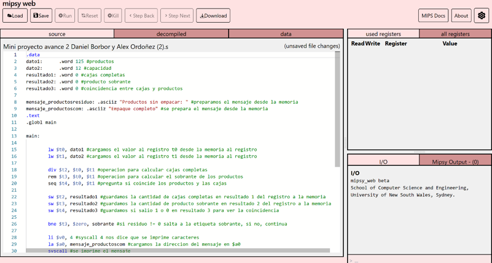
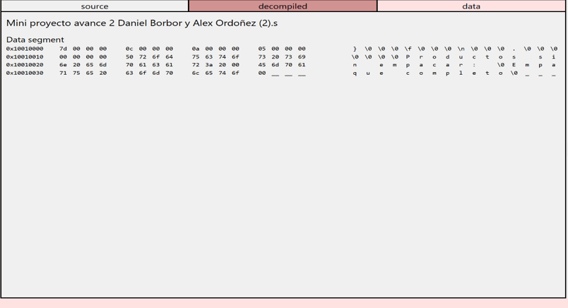
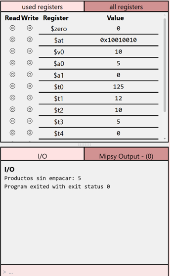

# Optimización de Empaque de Productos mediante Arquitectura MIPS

**Asignatura:** UCOM250_81 - Organización y Arquitectura de Computadores  
**Integrantes:** Alex Andrés Naranjo Ordóñez, Dimas Daniel Borbor Pozo  
**Año:** 2026  
**Fecha:** 3 de octubre de 2026

---

## Descripción

### Escenario

Una empresa tiene productos que deben colocarse en cajas de igual capacidad, teniendo una cantidad inicial de productos (125 productos) y de capacidad por caja (12 unidades). El problema reside en que no todas las cajas están completas, y la manera de solucionarlo es separando las cajas completas de los productos que sobran e imprimiendo la cantidad de productos sobrantes.

### Resultado

El programa calcula de manera automatizada el número de cajas completas empaquetadas (10 cajas) y determina la cantidad sobrante de productos sin empacar (5 productos). Además, verifica mediante una comparación lógica si la cantidad inicial de productos equivale a la capacidad de las cajas. Finalmente, evalúa mediante un salto condicional si existen sobrantes e imprime por pantalla el mensaje correspondiente con la cantidad de productos sin empacar o el mensaje de empaque completo.

---

## Análisis

### Datos del programa

Identificación de los datos proporcionados y almacenados en memoria dentro del escenario planteado:

| Dato | Valor inicial | Propósito |
|---|---:|---|
| `dato1` | 125 | Representa la cantidad total de productos a empaquetar. |
| `dato2` | 12 | Representa la capacidad máxima de cada caja. |
| `resultado1` | 0 | Almacena el número de cajas completas calculadas. |
| `resultado2` | 0 | Almacena la cantidad de productos sobrantes. |
| `resultado3` | 0 | Almacena la verificación de equivalencia entre productos y capacidad (1 = Verdadero, 0 = Falso). |

### Operaciones requeridas

Relación de las operaciones necesarias para resolver el escenario con sus correspondientes instrucciones MIPS:

| Datos / Resultados | Propósito | Operación requerida | Instrucción MIPS |
|---|---|---|---|
| `dato1` | Cargar cantidad de productos desde memoria al registro `$t0` | Carga | `lw` |
| `dato2` | Cargar capacidad de caja desde memoria al registro `$t1` | Carga | `lw` |
| `Resultado 1` | Calcular el número de cajas completas empaquetadas (`$t0 / $t1`) | División | `div` |
| `Resultado 2` | Calcular la cantidad de productos sobrantes sin empacar (`$t0 % $t1`) | Residuo | `rem` |
| `Resultado 3` | Verificar si productos y capacidad son equivalentes (`$t0 == $t1`) | Comparación | `seq` |
| `resultado1`, `2`, `3` | Guardar resultados obtenidos desde registros hacia la memoria | Almacenamiento | `sw` |
| Control de flujo | Evaluar si existe residuo (`$t3 != 0`) para saltar a impresión de sobrantes | Salto condicional | `bne` |
| Impresión | Mostrar mensajes de salida y valores numéricos en la consola | Llamadas al sistema | `syscall` |

---

## Implementación

El código ensamblador MIPS fue desarrollado y probado de manera funcional en el simulador.

### Versión base

La carpeta `version_base/` contiene el programa inicial utilizado como punto de partida.

**Archivo:**
`version_base/programa_base.s`

**Descripción del estado inicial:**  
Estructura inicial donde se definen las etiquetas base en el segmento `.data` y el esqueleto de la función principal en `.text`.

### Versión final

La carpeta `version_final/` contiene la solución optimizada y documentada.

**Archivo:**
`version_final/programa_final.s`

**Código fuente MIPS:**

```assembly
.data
    dato1:                   .word 125                           # productos
    dato2:                   .word 12                            # capacidad
    resultado1:              .word 0                             # cajas completas
    resultado2:              .word 0                             # producto sobrante 
    resultado3:              .word 0                             # coincidencia entre cajas y productos
    mensaje_productosresiduo:.asciiz "Productos sin empacar: "  # mensaje productos sobrantes
    mensaje_productoscom:    .asciiz "Empaque completo"          # mensaje empaque completo

.text
.globl main

main:
    # Carga de datos desde memoria
    lw $t0, dato1            # cargamos la cantidad de productos en $t0
    lw $t1, dato2            # cargamos la capacidad de las cajas en $t1

    # Operaciones aritméticas y lógicas
    div $t2, $t0, $t1        # operacion para calcular cajas completas
    rem $t3, $t0, $t1        # operacion para calcular el sobrante de los productos
    seq $t4, $t0, $t1        # pregunta si coinciden los productos y las cajas

    # Almacenamiento de resultados en memoria
    sw $t2, resultado1       # guardamos la cantidad de cajas completas
    sw $t3, resultado2       # guardamos la cantidad de producto sobrante
    sw $t4, resultado3       # guardamos coincidencia (0 o 1)

    # Control de flujo e impresión
    bne $t3, $zero, sobrante # si residuo != 0 salta a la etiqueta sobrante

    # Impresión si el empaque está completo (residuo == 0)
    li $v0, 4                # syscall 4: imprimir cadena de texto
    la $a0, mensaje_productoscom
    syscall
    
    li $v0, 10               # finalización limpia del programa
    syscall

sobrante:
    li $v0, 4                # syscall 4: imprimir cadena de texto
    la $a0, mensaje_productosresiduo
    syscall

    li $v0, 1                # syscall 1: imprimir entero
    add $a0, $t3, $zero      # movemos la cantidad sobrante ($t3) a $a0
    syscall

    li $v0, 10               # finalización limpia del programa
    syscall
```

---

## Evidencias de ejecución

### Código



**Descripción:**  
Estructura general del código fuente cargado en la interfaz del simulador Mipsy Web.

### Registros



**Descripción:**  
Inspección del segmento de datos (`.data`) en memoria y valor asignado a los registros tras la ejecución. Los registros `$t0` y `$t1` contienen los datos de entrada (125 y 12), `$t2` almacena las 10 cajas completas, `$t3` el residuo de 5 productos y `$t4` el estado de comparación (0).

### Resultado



**Descripción:**  
Salida final por consola en la sección I/O mostrando el mensaje `"Productos sin empacar: 5"` y la finalización exitosa con código de salida 0.

---

## Conclusiones

- **Procesamiento a bajo nivel:** A través del desarrollo del proyecto se comprendió de forma práctica la lógica de procesamiento a nivel de arquitectura de computadores, observando cómo las instrucciones de un conjunto de instrucciones (ISA) MIPS interactúan directamente con la memoria y el conjunto de registros.
- **Manejo de flujo de control:** Se fortaleció la capacidad de abstracción de problemas reales en código ensamblador, afianzando la importancia del manejo adecuado de llamadas al sistema (`syscall`), transferencias de datos (`lw`/`sw`) y saltos condicionales (`bne`) para construir ejecuciones estructuradas.
- **Resolución de problemas:** La experiencia permitió resolver de forma limpia la división lógica entre cociente y residuo utilizando instrucciones dedicadas (`div` y `rem`), garantizando un empaquetado exacto de mercancías con reporte de excedentes.

---

## Documentación

El reporte completo del proyecto en formato PDF se encuentra almacenado en:

```text
documentacion/reporte_proyecto.pdf
```

---

## Estructura del repositorio

```text
Optimizacion-Empaque-MIPS/
│
├── README.md
│
├── version_base/
│   └── programa_base.s
│
├── version_final/
│   └── programa_final.s
│
├── evidencias/
│   ├── codigo.png
│   ├── registros.png
│   └── resultado.png
│
└── documentacion/
    └── reporte_proyecto.pdf
```

---

## Bibliografía

Registre las fuentes utilizadas para comprender las instrucciones MIPS, el funcionamiento del simulador y cualquier otro concepto empleado durante el desarrollo.

Las referencias deben presentarse utilizando **normas APA, séptima edición**.

### Ejemplos

#### Página web

```text
University of New South Wales. (n.d.). MIPS instruction set.
https://cgi.cse.unsw.edu.au/~cs1521/current/resources/mips-guide.html
```

#### Libro

```text
Patterson, D. A., & Hennessy, J. L. (2021). Computer organization 
and design: The hardware/software interface (6th ed.). Morgan Kaufmann.
```

#### Documentación de software

```text
MARS. (n.d.). MIPS Assembler and Runtime Simulator.
http://courses.missouristate.edu/kenvollmar/mars/
```

### Referencias utilizadas

1. Patterson, D. A., & Hennessy, J. L. (2014). *Computer Organization and Design: The Hardware/Software Interface* (5th ed., pp. 62–66). Morgan Kaufmann.

2. Sánchez, C. (24 de enero de 2020). *Citas APA*. Normas APA. https://normas-apa.org/citas/

3. School of Computer Science and Engineering, UNSW Sydney. (2026). *COMP1521 — MIPS Instruction Set Reference & Mipsy Web*. University of New South Wales. https://cgi.cse.unsw.edu.au/~cs1521/current/resources/mips-guide.html#registers

4. Wikibooks. (17 de septiembre de 2023). *MIPS Assembly/Instruction Formats*. Wikibooks, The Free Textbook Project. https://en.wikibooks.org/wiki/MIPS_Assembly/Instruction_Formats

5. Wikibooks. (29 de mayo de 2024). *MIPS Assembly/Register File*. Wikibooks, The Free Textbook Project. https://en.wikibooks.org/wiki/MIPS_Assembly/Register_File
    add $a0, $t3, $zero      # movemos la cantidad sobrante ($t3) a $a0
    syscall

    li $v0, 10               # finalización limpia del programa
    syscall
